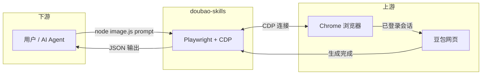

# doubao-skills

<div align="center">

[](https://github.com/ai-fzx/doubao-skills)
[](LICENSE)
[](https://nodejs.org)
[](https://playwright.dev)
[](https://www.doubao.com)

**通过 Playwright + Chrome CDP，让 AI 自动调用豆包的图片生成与视频生成能力。**

一次登录，永久复用 · 纯 JSON 输出 · 开箱即用

</div>

---

## 📋 目录

- [新手必读](#新手必读)
- [能力概览](#能力概览)
- [快速开始](#快速开始)
- [使用说明](#使用说明)
- [参数速查](#参数速查)
- [工作原理](#工作原理)
- [功能特性](#功能特性)
- [故障排查](#故障排查)
- [FAQ](#faq)
- [联系与作者](#联系与作者)
- [License](#license)

---

## 新手必读

本 Skill 是一个「中间人」程序：通过 Playwright 连接已登录 Chrome（CDP），在豆包网页自动完成图片生成与视频生成任务。没有它，无法直接调用豆包的生成能力。

**必须满足的前置条件**：

| # | 条件 | 说明 |
|---|------|------|
| 1 | 安装了 Google Chrome | 需要本地 Chrome 浏览器 |
| 2 | Chrome 以调试模式运行 | 需要开放端口 9222（见下方步骤） |
| 3 | 豆包已在该 Chrome 中登录 | 登录一次后永久有效 |

**注意**：本 Skill 走的是 Chrome 浏览器里的豆包网页端；不会自动显示在豆包 App 里。要看执行情况，请看终端侧输出，或开启调试模式。

---

## ✨ 能力概览

| 功能 | 脚本 | 描述 |
|------|------|------|
| 🎨 **图片生成** | `scripts/image.js` | 文生图，支持比例、数量控制，返回图片 URL 列表 |
| 🎬 **视频生成** | `scripts/video.js` | 文生视频，支持比例、时长控制，返回视频 URL |
| 🔧 **会话管理** | `scripts/ensure_chrome.js` | 自动检查/启动 Chrome，验证豆包登录状态 |

---

## 🚀 快速开始

### 第一步：安装依赖

```bash
cd scripts
npm install
```

### 第二步：启动调试模式 Chrome

**Windows（PowerShell）：**

```powershell
Start-Process -FilePath "C:\Program Files\Google\Chrome\Application\chrome.exe" `
  -ArgumentList "--remote-debugging-port=9222",`
                "--user-data-dir=C:\Users\$env:USERNAME\AppData\Local\Google\Chrome\User Data",`
                "--profile-directory=Default" `
  -PassThru -WindowStyle Normal
```

**macOS（Terminal）：**

```bash
"/Applications/Google Chrome.app/Contents/MacOS/Google Chrome" \
  --remote-debugging-port=9222 \
  --user-data-dir="$HOME/.config/google-chrome-doubao" \
  --profile-directory=Default &
```

### 第三步：登录豆包

在打开的 Chrome 中访问 [doubao.com](https://www.doubao.com) 并登录账号。**登录一次后永久有效，后续无需重复操作。**

### 第四步：验证环境

```bash
node scripts/ensure_chrome.js
```

看到 `✅ 豆包已登录，一切就绪！` 即表示环境配置完成。

---

## 📖 使用说明

### 常用命令速查

| 目的 | 命令 |
|------|------|
| 验证 Chrome 连接 | `node scripts/ensure_chrome.js` |
| 生成图片 | `node scripts/image.js "描述词"` |
| 生成视频 | `node scripts/video.js "描述词"` |
| 指定比例 | `--ratio=16:9` |
| 指定数量 | `--count=4` |
| 指定时长 | `--duration=10` |

### 图片生成

```bash
# 基础用法
node scripts/image.js "一只在竹林里喝茶的熊猫，水彩风格"

# 指定比例（16:9 横屏）
node scripts/image.js "赛博朋克城市夜景，霓虹灯光" --ratio=16:9

# 生成4张（最多4张）
node scripts/image.js "古风仕女，工笔画风格" --count=4

# 竖屏 + 4张
node scripts/image.js "森林精灵，奇幻风格" --ratio=9:16 --count=4
```

**返回示例：**

```json
{
  "success": true,
  "prompt": "一只在竹林里喝茶的熊猫，水彩风格",
  "options": { "ratio": "1:1", "count": 1 },
  "imageUrls": [
    "https://p9-flow-imagex-sign.byteimg.com/..."
  ],
  "imageCount": 1,
  "timestamp": "2026-03-27T13:45:00.000Z",
  "meta": { "generationDone": true, "doneReason": "stable", "attempt": 1 }
}
```

### 视频生成

```bash
# 基础用法（默认 16:9，5 秒）
node scripts/video.js "一只熊猫在竹林中漫步，镜头缓慢推进，治愈风格"

# 竖屏短视频（抖音/小红书格式）
node scripts/video.js "都市女孩走在街头，傍晚金光，slow motion" --ratio=9:16

# 指定时长
node scripts/video.js "星空延时摄影，银河流动" --duration=10

# 完整参数
node scripts/video.js "赛博朋克城市雨夜，飞行汽车穿梭" --ratio=16:9 --duration=5
```

> ⏳ **注意**：视频生成通常需要 **1-5 分钟**，请耐心等待，脚本会自动轮询直到完成。

**返回示例：**

```json
{
  "success": true,
  "prompt": "一只熊猫在竹林中漫步",
  "options": { "ratio": "16:9", "duration": 5 },
  "videoUrl": "https://v3-web.douyinvod.com/...",
  "thumbnailUrl": "https://p9-flow-imagex-sign.byteimg.com/...",
  "downloadUrl": "https://...",
  "timestamp": "2026-03-27T13:50:00.000Z",
  "meta": { "generationDone": true, "doneReason": "stable", "attempt": 1 }
}
```

---

## ⚙️ 参数速查

### image.js

| 参数 | 类型 | 默认 | 可选值 |
|------|------|------|--------|
| `prompt` | string | 必填 | 任意描述文本 |
| `--ratio` | string | `1:1` | `1:1` `16:9` `9:16` `4:3` `3:4` |
| `--count` | number | `1` | `1` `2` `3` `4` |

### video.js

| 参数 | 类型 | 默认 | 可选值 |
|------|------|------|--------|
| `prompt` | string | 必填 | 任意描述文本 |
| `--ratio` | string | `16:9` | `16:9` `9:16` `1:1` |
| `--duration` | number | `5` | `5` `10`（秒） |

### 环境变量

| 变量 | 默认值 | 说明 |
|------|--------|------|
| `DOUBAO_CDP_URL` | `http://127.0.0.1:9222` | Chrome CDP 地址 |
| `CHROME_USER_DATA_DIR` | 系统默认 | 自定义 Chrome 用户数据目录 |

---

## 🔄 工作原理



**协议**：纯 JSON-RPC，通过 stdout 输出；调试日志在 stderr。

---

## ✨ 功能特性

- 🎨 **图片生成**：支持多种比例（1:1、16:9、9:16 等）和数量控制
- 🎬 **视频生成**：支持竖屏/横屏、5-10 秒时长
- 🔐 **一次登录，永久复用**：豆包登录状态持久化
- 📦 **纯 JSON 输出**：方便 AI Agent 解析和集成
- 🔧 **自动重试**：生成失败自动重试，默认最多 3 次
- ⏱️ **自动等待**：视频生成自动轮询直到完成
- 🌐 **跨平台**：Windows/macOS/Linux 通用

---

## 🛠️ 故障排查

| 错误码 | 原因 | 解决方案 |
|--------|------|----------|
| `NOT_LOGGED_IN` | Chrome 未登录豆包 | 手动打开豆包登录，登录后重试 |
| `INPUT_NOT_FOUND` | 页面未加载完成 / 结构变化 | 稍等片刻后重试，或更新 selector |
| `CDP connection failed` | Chrome 未以调试模式运行 | 执行第二步，重新启动 Chrome |
| `MAX_RETRIES_EXCEEDED` | 网络异常或页面报错 | 检查网络，刷新豆包页面后重试 |
| 图片 URL 为空 | 页面 selector 未匹配 | 更新 `image.js` 中的 `extractImageUrls` |
| 视频 URL 为空 | 生成超时（默认 360 秒） | 增大 `options.timeout`，或直接打开浏览器查看 |

---

## 🙋 FAQ

**Q：为什么要用 Chrome CDP，而不是直接调用豆包 API？**

> 豆包图片/视频生成功能目前没有开放的公共 API，通过 CDP 操控已登录的浏览器是最稳定的自动化方案。

**Q：视频生成需要多久？**

> 通常 1-5 分钟，取决于豆包服务器负载。脚本默认最多等待 6 分钟。

**Q：图片 URL 有有效期吗？**

> 豆包返回的图片 URL 通常是有签名的 CDN 链接，建议生成后尽快下载保存。

**Q：可以批量生成多条 prompt 吗？**

> 目前不支持批量模式，需要逐条调用。每次调用会新建一个对话，互不干扰。

**Q：支持图片参考/图生图吗？**

> 当前版本只支持文生图/文生视频，图生图功能待后续版本支持。

**Q：Chrome 端口 9222 被占用怎么办？**

> 可以换成其他端口，如 `--remote-debugging-port=9223`，然后设置环境变量 `DOUBAO_CDP_URL=http://127.0.0.1:9223`

---

## 📁 文件结构

```
doubao-skills/
├── SKILL.md                  # 技能描述（供 AI Agent 读取）
├── README.md                 # 本文档
├── LICENSE                   # MIT 许可证
└── scripts/
    ├── package.json          # 依赖（playwright）
    ├── image.js              # 图片生成脚本
    ├── video.js              # 视频生成脚本
    └── ensure_chrome.js      # Chrome 启动 & 登录检测
```

---

## 👤 联系与作者

**风之馨**，风之馨品牌创始人。

| 项目 | 内容 |
|------|------|
| 风之馨 | 身份：风之馨品牌创始人 |
| GitHub | [@ai-fzx](https://github.com/ai-fzx) |
| 微信公众号 | 风之馨技术录 |
| 问题反馈 | [GitHub Issues](https://github.com/ai-fzx/doubao-skills/issues) |

欢迎通过 Issues、公众号交流本 Skill。

---

## 📄 License

[MIT](LICENSE) © 风之馨
